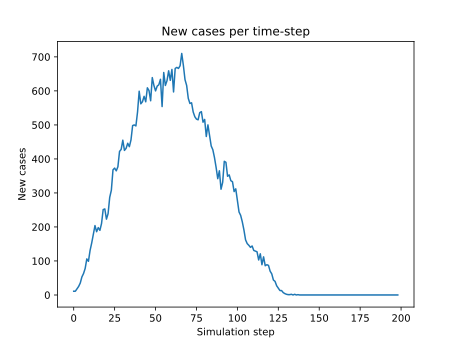

# A simple infection model

I did this out of curiosity.


The code works as follows:

1. Evenly distributes people in a 2D box
2. Each person does a random walk
3. If an infected person gets close to a susceptible person, there is a chance they spread infection to them
4. iterate (2) and (3) until all steps complete


## Visual Representation
Visually this looks as follows:


# "Case per day" Plot




# Usage and explanation of parameters


## Building
If you have GCC/G++ installed you can build the code as follows

```
make
```


## Running
Then you can run it by supplying a parameter file

```
./main example.cfg
```


## Parameter file
The parameter file has the same structure as the example given below

```python
ninit=5 #number of initial infections to start simulation with
output_nodes=True #If true it will output files for postprocessing by Python scripts
max_print_nodes=1000 #Maximum number of output files to generate (files are generated for every time-step)
npeople=5000 #Number of people in simulation
xleft=-500.0 # Left bound of box
xright=500.0 # Right bound of box
ybottom=-500.0 # Bottom bound of box
ytop=500.0 # Top bound of box
infectious_period=2 # Number of time periods an infected individual can infect others
dx=6.0 # distance in x direction individual travels each step
dy=6.0 # distance in y direction individual travels each step
nsteps=10000 # Number of time-steps to run simulation for
infection_radius=16.0 # The radius such that if a susceptible individual is this distance from an infected individual, they run risk of infection
probability=0.40 # Probability that an infected individual can infect a susceptible individual if they are within the infectious radius
import_probability=0.001 # Probability of importing a new case, runs every time-step.
```


## Post-processing scripts

There are some python files which can produce nice plots based on the output data. Just run the python scripts
on the same paramter file after running the C++ code.

```
./main example.cfg
python hist_plot.py example.cfg
```


# Limitations

## Parallel implementation

Implementation isn't ideal, has a lot of atomic operations and barriers. The algorithm itself might be able to be improved to `n*log(n)` rather than `n^2`.


## Statistical

I'm using random number generators for things like random walks, infection chances, chance of importing new cases. To make implementation easier I just give each thread its own random number generator with a different seed. This is not statistically sound, though it's probably fine for making _qualitative_ conclusions. If one wanted to do some kind of monte carlo use of this code however this would likely need to be addressed, for example through [skip-ahead](https://www.nag.co.uk/content/skipping-ahead-mersenne-twister-random-number-generator) 
techniques.


## I don't know what I'm doing

I'm not an epidemiologist. This was just a curiosity to me. I wanted to play with different parameters in a toy infection model to see what happens.
